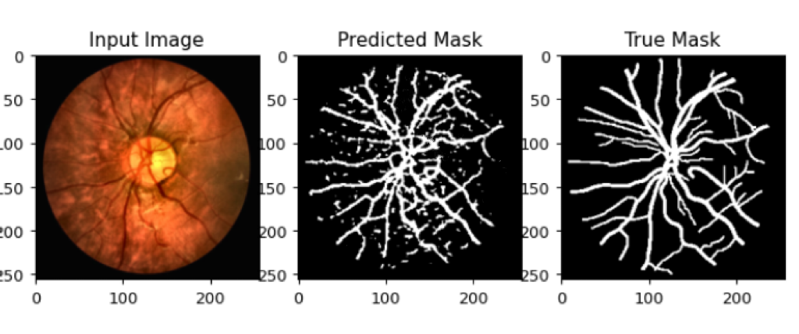

# U-Net Based Retinal Vessel Segmentation


---

## Project Description

This project implements **retinal vessel segmentation** using a **U-Net architecture** with a **ResNet-34 encoder**. Retinal vessel segmentation is critical for diagnosing diseases such as **diabetic retinopathy** and **cardiovascular disorders**.

The model combines **image preprocessing** and **deep learning** to handle variations in retinal images caused by different imaging devices. Our goal is to achieve accurate segmentation that works across datasets.


---

## Table of Contents

1. [Datasets](#datasets)
2. [Pipeline Overview](#pipeline-overview)
3. [Methodology](#methodology)
4. [Results](#results)
5. [System Configuration](#system-configuration)
6. [How to Run](#how-to-run)
7. [References](#references)
8. [Contact](#contact)

---

## Datasets

We used the following retinal vessel datasets:

| Dataset        | Purpose      | Camera Type                  | Resolution       | Number of Images |
|----------------|--------------|------------------------------|------------------|------------------|
| **DRIVE**     | Training     | Canon CR5 (45° FOV)          | 565×584          | 40               |
| **CHASE_DB1** | Testing      | Nikon NM 210 (30° FOV)       | 1280×960         | 28               |

---

## Pipeline Overview

The project pipeline consists of the following steps:

1. **Data Preprocessing**:
   - CLAHE (Contrast Limited Adaptive Histogram Equalization) to enhance vessel visibility.
   - Resize images and masks to **256×256** pixels.
   - Normalize using ImageNet mean and standard deviation.
   - Binarize segmentation masks.

2. **Model**:
   - **U-Net with ResNet-34 encoder** initialized with ImageNet weights.
   - **Skip connections** for preserving fine-grained spatial details.

3. **Loss Function**:
   - Combination of **Dice Loss** and **BCEWithLogitsLoss** for accurate segmentation.

4. **Adaptive Batch Normalization**:
   - Update batch normalization statistics to adapt the model to the target domain.

5. **Evaluation**:
   - Metrics: **Mean Dice Score** and **Mean IoU Score**.
   - Visual comparisons between input, predicted masks, and ground truth.


---

## Methodology

### 1. Image Preprocessing

- CLAHE enhances the visibility of blood vessels while preserving color integrity.
- Images and masks are resized to **256×256**.
- Masks are binarized into clean binary maps (0 and 1).

### 2. Loss Function

| Loss Type            | Purpose                           |
|-----------------------|-----------------------------------|
| **Dice Loss**        | Measures overlap accuracy         |
| **BCE Loss**         | Pixel-level binary classification |
| **Combined Loss**    | Weighted combination of both      |

### Combined Loss Formula:

\[
\text{Combined Loss} = 0.5 \times \text{Dice Loss} + 0.5 \times \text{BCE Loss}
\]


### 3. Model

- **U-Net** architecture with a **ResNet-34 encoder** pre-trained on ImageNet.
- **Adam Optimizer**: Learning rate = 1×10⁻⁴.

---

## Results

| Metric               | Value    |
|-----------------------|----------|
| **Mean Dice Score**  | 0.3019   |
| **Mean IoU Score**   | 0.1779   |

### Sample Results
<p align="center" style="margin-top: -40px; margin-bottom: 5px;">
    
</p>

---

## System Configuration

The experiments were conducted on the following hardware and software setup:

| Component               | Details                       |
|--------------------------|-------------------------------|
| **CPU**                 | AMD Ryzen 7 (3.2 GHz, 8 Cores) |
| **GPU 1**               | AMD Radeon(TM) Graphics (2GB) |
| **GPU 2**               | NVIDIA GeForce RTX 3070 Laptop GPU (4GB) |
| **RAM**                 | 16 GB                         |
| **Operating System**    | Windows 10                    |
| **Python Version**      | 3.x                           |
| **Framework**           | PyTorch                       |

---

## How to Run

### Prerequisites

- Python 3.x
- PyTorch
- OpenCV
- NumPy
- Matplotlib
- segmentation-models-pytorch

### Steps

1. **Clone the Repository**:
   ```bash
   git clone https://github.com/your_username/retinal-vessel-segmentation.git
   cd retinal-vessel-segmentation
   ```

2. **Install Dependencies**:
   ```bash
   pip install -r requirements.txt
   ```

3. **Train the Model**:
   ```bash
   python main.py
   ```

4. **Evaluate the Model**:
   ```bash
   python main.py --evaluate
   ```

5. **Visualize Results**:
   - Outputs are saved in the `results/` directory.

---

## References

1. Abràmoff, M. D., Garvin, M. K., & Sonka, M. (2010). *Retinal imaging and image analysis*. IEEE Reviews in Biomedical Engineering, 3, 169-208.
2. Ronneberger, O., Fischer, P., & Brox, T. (2015, October). *U-net: Convolutional networks for biomedical image segmentation*. In International Conference on Medical Image Computing and Computer-Assisted Intervention (pp. 234-241).
3. Litjens, G., Kooi, T., Bejnordi, B. E., Setio, A. A. A., Ciompi, F., Ghafoorian, M., ... & Sánchez, C. I. (2017). *A survey on deep learning in medical image analysis*. Medical Image Analysis, 42, 60-88.
4. Ronneberger, O., Fischer, P., & Brox, T. (2015). *U-NET: Convolutional Networks for Biomedical Image Segmentation*. Lecture notes in computer science, 234–241. doi: 10.1007/978-3-319-24574-4_28.

---
